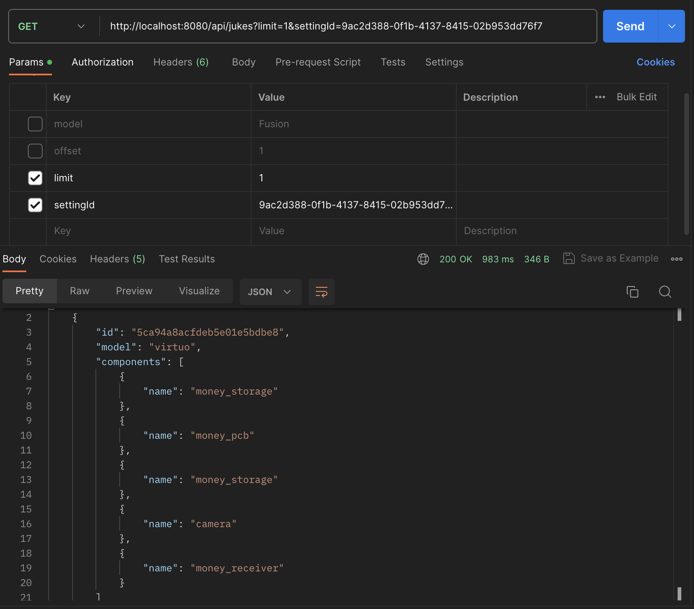

# JukeBox GET api implementation

## Build

1. `docker build --tag {name_of_img} .`
2. `docker run -p 8080 {name_of_img}`

### _Endpoint: http://localhost:8000/api/jukes_

## Functionality

Returns a list of JukeBoxes that fit the given parameters

## Thoughts/Conclusions

Overall a great learning lesson, as I learned more about Spring Boot, and how certain concepts transfered over from JS -> Java (express -> Spring boot).
This was an exciting problem to solve, that required learning new technologies.
